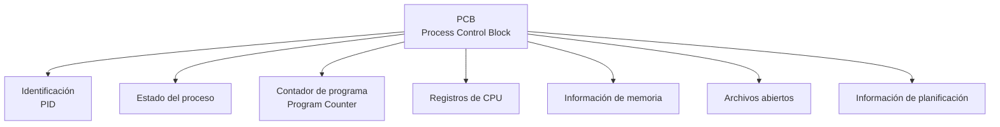

# Bloque de Control de Proceso (PCB)


Cuando un sistema operativo administra varios procesos, necesita guardar información sobre cada uno de ellos. No basta con saber el nombre del programa que se está ejecutando; el sistema operativo debe conocer su estado, dónde estaba ejecutándose, qué recursos utiliza y otra información necesaria para poder controlarlo.

Para almacenar esta información, el sistema operativo utiliza una estructura llamada **Bloque de Control de Proceso**, conocida como **PCB (Process Control Block)**.

## ¿Qué es el PCB?

El **PCB es una estructura de datos utilizada por el sistema operativo para almacenar la información necesaria para administrar un proceso**.

Cada proceso tiene asociado su propio PCB. En él se guarda el contexto y diferentes datos que permiten al sistema operativo identificar, ejecutar, suspender, reanudar y finalizar el proceso.

Podemos imaginarlo como una **ficha de identificación del proceso**:

```text
                 PROCESO
                    │
                    ▼
            ┌───────────────┐
            │      PCB      │
            ├───────────────┤
            │ PID           │
            │ Estado        │
            │ Registros     │
            │ PC            │
            │ Memoria       │
            │ Archivos      │
            │ Información   │
            │ de planificación│
            └───────────────┘
```

El PCB no contiene necesariamente el programa completo. Su función principal es mantener la información que el sistema operativo necesita para **controlar y administrar ese proceso**.

---

# ¿Por qué es importante el PCB?

El PCB es fundamental porque un sistema operativo puede tener muchos procesos activos al mismo tiempo.

Si un proceso deja de utilizar temporalmente la CPU y posteriormente vuelve a ejecutarse, el sistema operativo necesita saber **exactamente dónde había quedado**.

Por ejemplo:

```text
Proceso A
    ↓
Está ejecutándose
    ↓
Se interrumpe
    ↓
El SO guarda su información en el PCB
    ↓
Se ejecuta otro proceso
    ↓
Proceso A vuelve a utilizar la CPU
    ↓
El SO recupera la información del PCB
    ↓
Proceso A continúa
```

Gracias a esta información, el proceso puede continuar desde un estado coherente en lugar de comenzar nuevamente desde el principio.

Esto está directamente relacionado con el **cambio de contexto (Context Switch)**, que estudiaremos posteriormente en esta unidad.

---

# Información almacenada en el PCB

Aunque la estructura exacta depende del sistema operativo, normalmente un PCB contiene diferentes categorías de información.

## 1. Identificador del proceso (PID)

El **PID (Process ID)** es un número que identifica de manera única a un proceso dentro del sistema.

Por ejemplo:

```text
PID 1204 → navegador
PID 1350 → editor
PID 1421 → terminal
```

El sistema operativo utiliza estos identificadores para distinguir un proceso de otro.

En Linux, podemos observar los procesos y sus PID mediante:

```bash
ps
```

También podemos utilizar:

```bash
ps aux
```

El PID permite que el sistema operativo y otras herramientas puedan referirse específicamente a un proceso.

---

## 2. Estado del proceso

El PCB también contiene información sobre el **estado actual del proceso**.

Por ejemplo, el proceso puede estar:

* Nuevo.
* Listo.
* En ejecución.
* Bloqueado o esperando.
* Terminado.

Esta información permite al sistema operativo saber cómo debe tratar al proceso en ese momento.

Por ejemplo, un proceso bloqueado esperando una operación de entrada/salida no debería recibir la CPU mientras continúa esperando.

---

## 3. Contador de programa

El **contador de programa (Program Counter o PC)** contiene la dirección de la próxima instrucción que debe ejecutarse.

Podemos imaginarlo como un marcador que indica:

> “Aquí debe continuar el proceso cuando vuelva a ejecutarse”.

Por ejemplo:

```text
Instrucción 1
Instrucción 2
Instrucción 3  ← última ejecutada
Instrucción 4  ← próxima instrucción
Instrucción 5
```

El contador de programa permite que el proceso pueda continuar desde el punto correcto después de una interrupción o cambio de contexto.

---

## 4. Registros del procesador

El PCB también puede almacenar información relacionada con los **registros de la CPU** utilizados por el proceso.

Los registros son pequeñas áreas de almacenamiento dentro del procesador que contienen información necesaria durante la ejecución.

Por ejemplo, pueden existir registros utilizados para:

* Operaciones aritméticas.
* Direcciones.
* Datos temporales.
* Estado del procesador.
* Control de la ejecución.

Cuando ocurre un cambio de contexto, el sistema operativo necesita guardar el estado de los registros del proceso que deja de ejecutarse.

Posteriormente, cuando ese proceso vuelva a utilizar la CPU, esos valores pueden restaurarse.

---

## 5. Información de administración de memoria

El PCB también puede contener información relacionada con el espacio de memoria utilizado por el proceso.

Dependiendo de la arquitectura y del sistema operativo, esta información puede estar relacionada con:

* Tablas de páginas.
* Segmentos.
* Límites de memoria.
* Direcciones utilizadas por el proceso.
* Información del espacio de direcciones.

Esto permite que el sistema operativo pueda administrar la memoria de cada proceso y mantener separados sus espacios de memoria.

Por ejemplo:

```text
Memoria

┌─────────────────────┐
│ Proceso A           │
│ Espacio de memoria  │
├─────────────────────┤
│ Proceso B           │
│ Espacio de memoria  │
├─────────────────────┤
│ Proceso C           │
│ Espacio de memoria  │
└─────────────────────┘
```

Esta separación ayuda a evitar que un proceso acceda directamente a la memoria perteneciente a otro proceso.

---

## 6. Archivos abiertos

Un proceso puede trabajar con diferentes archivos y dispositivos mientras se está ejecutando.

Por esta razón, el sistema operativo necesita mantener información sobre los **archivos abiertos asociados con el proceso**.

Por ejemplo, un proceso podría tener:

```text
Proceso
   │
   ├── archivo.txt
   ├── datos.csv
   └── salida.log
```

Esta información permite al sistema operativo saber qué recursos de entrada/salida están siendo utilizados por el proceso.

---

## 7. Información de planificación

El PCB también puede contener información utilizada por el sistema operativo para tomar decisiones de **planificación de CPU**.

Por ejemplo, puede incluir datos relacionados con:

* Prioridad del proceso.
* Información de la cola donde se encuentra.
* Parámetros utilizados por el planificador.
* Tiempo de CPU utilizado.

Esta información ayuda al sistema operativo a decidir qué proceso debe recibir la CPU.

---

# Estructura general del PCB

Podemos resumir la información anterior mediante el siguiente esquema:



El diagrama muestra que el PCB funciona como un punto central donde el sistema operativo mantiene diferentes datos necesarios para administrar el proceso.

---

# PCB y cambio de contexto

El PCB tiene una relación muy importante con el **cambio de contexto**.

Supongamos que el proceso A está utilizando la CPU y el sistema operativo decide darle el turno al proceso B.

Primero, el sistema operativo debe guardar la información necesaria del proceso A:

```text
Proceso A
    ↓
Se interrumpe
    ↓
Guardar contexto
    ↓
PCB de A
```

Después, el sistema operativo recupera la información que tenía guardada para el proceso B:

```text
PCB de B
    ↓
Restaurar contexto
    ↓
Proceso B
    ↓
Continúa su ejecución
```

De forma simplificada:

```text
       PROCESO A
           │
           │ guardar contexto
           ▼
       PCB de A
           │
           │ cambiar
           ▼
       PCB de B
           │
           │ restaurar contexto
           ▼
       PROCESO B
```

Este proceso permite que la CPU pueda alternar entre diferentes procesos sin perder la información necesaria para continuar su ejecución.

---

# Ejemplo práctico

Imaginemos que tenemos dos procesos:

```text
Proceso A → PID 101
Proceso B → PID 102
```

El proceso A está ejecutándose y su contador de programa indica que debe continuar con una determinada instrucción.

Cuando ocurre una interrupción, el sistema operativo puede guardar información como:

```text
PCB del Proceso A

PID: 101
Estado: Listo
Program Counter: dirección de la próxima instrucción
Registros: valores guardados
Memoria: información del espacio de direcciones
Archivos: archivos abiertos
```

Después, el sistema operativo puede cargar la información correspondiente al proceso B y permitir que continúe su ejecución.

Más adelante, cuando A vuelva a recibir la CPU, el sistema operativo utilizará la información almacenada en su PCB para recuperar su contexto.

---

# ¿El PCB es igual en todos los sistemas operativos?

No exactamente.

El concepto de PCB es general y forma parte de la administración de procesos, pero **la estructura interna concreta depende del sistema operativo y de su implementación**.

Por eso, los sistemas operativos pueden utilizar diferentes estructuras y nombres internos para almacenar información relacionada con los procesos.

Lo importante es entender la función:

> El sistema operativo necesita mantener información sobre cada proceso para poder administrarlo correctamente.

---

# Relación entre el PCB y los estados del proceso

El PCB y los estados del proceso están directamente relacionados.

Cuando un proceso cambia de estado, el sistema operativo actualiza la información correspondiente.

Por ejemplo:

```text
              PCB
               │
               ▼
        Estado: LISTO
               │
               │ CPU asignada
               ▼
        Estado: EJECUCIÓN
               │
               │ Espera de E/S
               ▼
        Estado: BLOQUEADO
```

De esta manera, el PCB ayuda al sistema operativo a mantener actualizado el estado de cada proceso.

---

# En resumen

El **PCB (Process Control Block)** es una estructura fundamental para la administración de procesos.

En él se mantiene información como:

| Información           | Función                                                                 |
| --------------------- | ----------------------------------------------------------------------- |
| **PID**               | Identifica al proceso.                                                  |
| **Estado**            | Indica la situación actual del proceso.                                 |
| **Program Counter**   | Indica la próxima instrucción que debe ejecutarse.                      |
| **Registros**         | Permiten guardar el contexto del procesador.                            |
| **Memoria**           | Mantiene información relacionada con el espacio de memoria del proceso. |
| **Archivos abiertos** | Registra recursos de entrada/salida utilizados.                         |
| **Planificación**     | Contiene información utilizada por el planificador de CPU.              |

La idea principal puede resumirse así:

```text
                 SISTEMA OPERATIVO
                         │
              administra procesos
                         │
                         ▼
                    ┌─────────┐
                    │   PCB   │
                    └────┬────┘
                         │
       ┌─────────────────┼─────────────────┐
       ▼                 ▼                 ▼
      PID              Estado          Contexto
                                           │
                              ┌────────────┼────────────┐
                              ▼            ▼            ▼
                          Registros    Memoria      Program Counter
```

Sin el PCB, el sistema operativo no tendría una forma organizada de conservar la información necesaria para controlar cada proceso.

Por eso, el PCB es una pieza fundamental para comprender cómo funcionan mecanismos posteriores como el **cambio de contexto y la planificación de CPU**.
