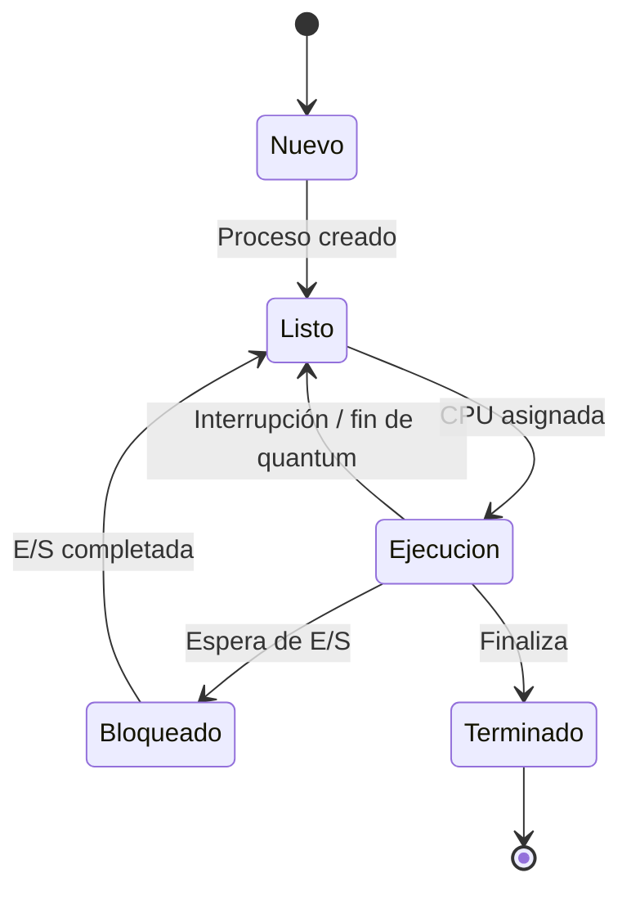

# Estados de un Proceso


Un proceso no permanece ejecutándose todo el tiempo. Durante su ciclo de vida, puede encontrarse en diferentes situaciones dependiendo de lo que esté haciendo y de los recursos que necesite.

Por ejemplo, un proceso puede estar esperando que el procesador quede disponible, ejecutándose, esperando una operación de entrada/salida o haber terminado su trabajo.

Para representar estas situaciones, el sistema operativo utiliza **estados de proceso**. Los estados permiten conocer qué está haciendo un proceso y qué debe ocurrir para que pueda pasar a otra situación.

## Los cinco estados principales

En el modelo básico de cinco estados, un proceso puede encontrarse en:

* **Nuevo**
* **Listo**
* **Ejecución**
* **Bloqueado o Espera**
* **Terminado**

Cada estado representa una situación diferente dentro del ciclo de vida del proceso.

---

## 1. Nuevo

El estado **Nuevo** corresponde al momento en que un proceso acaba de ser creado.

En este momento, el sistema operativo comienza a preparar todo lo necesario para que el proceso pueda ejecutarse. Por ejemplo, debe asignarle un identificador y preparar las estructuras de información que utilizará para administrarlo.

Podemos imaginarlo como:

```text
Usuario inicia un programa
          ↓
    Se crea un proceso
          ↓
        NUEVO
```

Después de ser creado y preparado, el proceso puede pasar al estado **Listo**.

---

## 2. Listo

Un proceso está en estado **Listo** cuando ya tiene todo lo necesario para ejecutarse, pero está esperando que el procesador le sea asignado.

Esto es importante porque varios procesos pueden estar listos al mismo tiempo, mientras que un núcleo de CPU solo puede ejecutar un proceso a la vez en un momento determinado.

Por ejemplo:

```text
CPU
 │
 ├── Proceso A → Ejecutándose
 │
 └── Procesos B, C y D → Esperando
                         en LISTO
```

El sistema operativo utiliza un mecanismo de **planificación de CPU** para decidir cuál de los procesos listos recibirá el procesador.

Este concepto será estudiado con mayor detalle en el tema de **Planificación de CPU y Quantum de Tiempo**.

---

## 3. Ejecución

Un proceso se encuentra en estado **Ejecución** cuando el procesador está ejecutando sus instrucciones.

Dependiendo del sistema y de la cantidad de núcleos disponibles, puede haber uno o varios procesos ejecutándose al mismo tiempo.

Mientras está en ejecución, pueden ocurrir diferentes situaciones:

* El proceso puede terminar su trabajo.
* Puede ser interrumpido para permitir que otro proceso utilice la CPU.
* Puede necesitar una operación de entrada/salida y pasar a estado Bloqueado.

Por ejemplo:

```text
LISTO
  │
  │ El planificador asigna CPU
  ▼
EJECUCIÓN
```

---

## 4. Bloqueado o Espera

Un proceso pasa al estado **Bloqueado** cuando no puede continuar su ejecución porque necesita esperar algún evento o recurso.

Una situación común ocurre cuando el proceso solicita una operación de entrada/salida, como leer información de un archivo o esperar datos de un dispositivo.

Por ejemplo:

```text
EJECUCIÓN
    │
    │ Solicita entrada/salida
    ▼
BLOQUEADO
    │
    │ Termina la operación
    ▼
LISTO
```

Mientras está bloqueado, el proceso **no necesita ocupar la CPU**, por lo que el sistema operativo puede utilizar el procesador para ejecutar otro proceso.

Esta característica permite aprovechar mejor los recursos del sistema.

---

## 5. Terminado

El estado **Terminado** indica que el proceso ha finalizado su ejecución.

Cuando esto ocurre, el sistema operativo debe liberar los recursos que estaban asociados al proceso, como memoria, archivos abiertos y otras estructuras utilizadas durante su ejecución.

El ciclo puede representarse de forma sencilla:

```text
EJECUCIÓN
    │
    │ Finaliza
    ▼
TERMINADO
```

Una vez que un proceso llega a este estado, deja de participar en la planificación de la CPU.

---

# Ciclo de vida de un proceso

Los estados anteriores están relacionados mediante **transiciones**. Una transición ocurre cuando algún evento hace que el proceso cambie de un estado a otro.

El siguiente diagrama muestra el ciclo de vida básico:



Este diagrama permite observar que un proceso **no necesariamente pasa directamente de Nuevo a Ejecución**. Primero debe estar preparado y entrar en la cola de procesos listos.

También muestra que un proceso puede pasar varias veces entre **Listo, Ejecución y Bloqueado** antes de terminar.

---

# ¿Qué provoca cada transición?

Las transiciones no ocurren de manera aleatoria. Generalmente son provocadas por eventos específicos.

| Transición            | ¿Qué ocurre?                                                |
| --------------------- | ----------------------------------------------------------- |
| Nuevo → Listo         | El proceso ha sido creado y está preparado para ejecutarse. |
| Listo → Ejecución     | El planificador le asigna la CPU.                           |
| Ejecución → Listo     | El proceso es interrumpido o termina su quantum.            |
| Ejecución → Bloqueado | El proceso necesita esperar una operación o evento.         |
| Bloqueado → Listo     | La operación que estaba esperando termina.                  |
| Ejecución → Terminado | El proceso finaliza su ejecución.                           |

## Ejemplo práctico

Imaginemos que abrimos un programa para leer un archivo.

Primero, el sistema operativo crea el proceso:

```text
NUEVO
```

Después de prepararlo, el proceso queda esperando su turno para utilizar el procesador:

```text
LISTO
```

Cuando el planificador le asigna la CPU, comienza a ejecutar:

```text
EJECUCIÓN
```

Durante la ejecución, el programa necesita leer un archivo. Como debe esperar a que termine la operación de entrada/salida, el proceso pasa a:

```text
BLOQUEADO
```

Mientras el proceso espera, otro proceso puede utilizar la CPU.

Cuando la lectura termina, el proceso vuelve a:

```text
LISTO
```

Posteriormente, el planificador puede volver a asignarle la CPU:

```text
EJECUCIÓN
```

Finalmente, cuando termina de realizar todas sus instrucciones:

```text
TERMINADO
```

Podemos resumir este ejemplo así:

```text
NUEVO
  ↓
LISTO
  ↓
EJECUCIÓN
  ↓
BLOQUEADO
  ↓
LISTO
  ↓
EJECUCIÓN
  ↓
TERMINADO
```

## ¿Por qué son importantes los estados?

Los estados permiten al sistema operativo **controlar y organizar los procesos**.

Por ejemplo, si un proceso está bloqueado esperando una operación de entrada/salida, no tiene sentido mantenerlo ocupando la CPU. El sistema operativo puede ponerlo en espera y utilizar el procesador para otro proceso que sí esté listo para ejecutarse.

De esta manera, los estados ayudan a aprovechar mejor los recursos y permiten que múltiples procesos compartan el sistema de manera organizada.

Además, comprender estos estados es necesario para estudiar otros conceptos de esta unidad, como:

* **PCB (Process Control Block)**.
* **Cambios de contexto**.
* **Planificación de CPU**.
* **Quantum de tiempo**.
* **Procesos e hilos (threads)**.

---

# En resumen

Un proceso atraviesa diferentes estados durante su ciclo de vida. Los cinco estados básicos son:

**Nuevo → Listo → Ejecución → Bloqueado → Terminado**

Sin embargo, el proceso puede regresar entre algunos estados varias veces. Por ejemplo, puede pasar de Ejecución a Bloqueado y posteriormente volver a Listo antes de ejecutarse nuevamente.

La idea principal es que el sistema operativo utiliza estos estados para saber **qué está haciendo cada proceso y cómo debe administrarlo**.

```text
┌─────────┐
│  NUEVO  │
└────┬────┘
     ↓
┌─────────┐
│  LISTO  │◄──────────────┐
└────┬────┘               │
     ↓                    │
┌────────────┐            │
│ EJECUCIÓN  │            │
└──┬─────┬───┘            │
   │     │                │
   │     └──────────────► │
   │       BLOQUEADO      │
   │                      │
   └──────────────► TERMINADO
```

**Un proceso cambia de estado dependiendo de los recursos que necesita y de las decisiones que toma el sistema operativo para administrar la CPU.**
