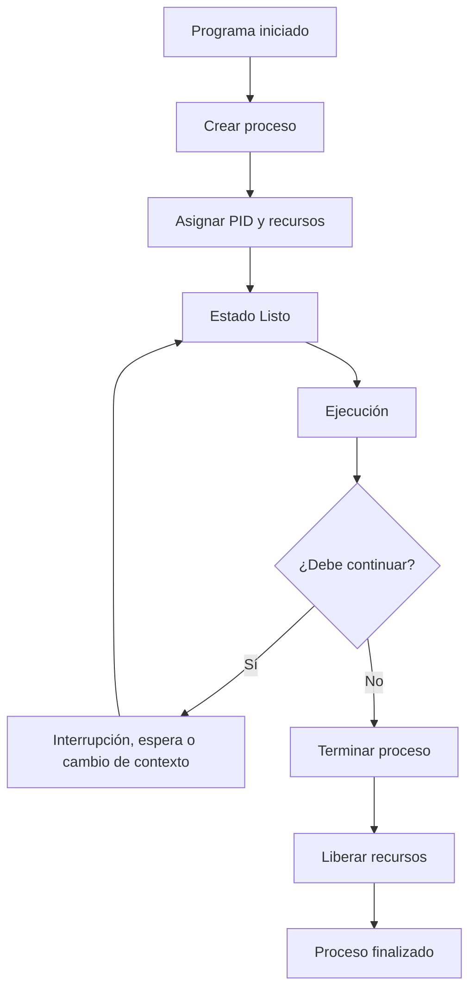

# Transiciones y Control


El sistema operativo no solamente crea procesos y les asigna recursos. También debe **controlar su ejecución**, decidir cuándo pueden utilizar el procesador y reaccionar ante diferentes eventos que ocurren durante su ciclo de vida.

Un proceso puede pasar de un estado a otro, ser interrumpido temporalmente, reanudar su ejecución o finalizar. Para realizar estas tareas, el sistema operativo utiliza diferentes mecanismos de control.

Entre los más importantes se encuentran el **cambio de contexto**, la creación de procesos y la terminación de procesos.

---

# Cambio de contexto (Context Switch)

Un **cambio de contexto**, conocido como **Context Switch**, ocurre cuando el sistema operativo deja temporalmente de ejecutar un proceso para comenzar o continuar la ejecución de otro.

Por ejemplo, imaginemos que el proceso A está utilizando la CPU:

```text
CPU
 │
 ▼
Proceso A
```

Si el sistema operativo decide que ahora debe ejecutarse el proceso B, primero necesita guardar la información necesaria del proceso A y después recuperar la información del proceso B.

```text
Proceso A
    │
    │ Guardar contexto
    ▼
   PCB A
    │
    │
    ▼
   PCB B
    │
    │ Restaurar contexto
    ▼
Proceso B
```

De esta manera, el proceso A puede continuar posteriormente desde el punto en el que fue interrumpido.

## ¿Qué se guarda durante un cambio de contexto?

La información necesaria depende del sistema operativo y de la arquitectura del computador, pero generalmente se debe conservar información relacionada con el estado de ejecución del proceso.

Entre ella se encuentran:

* Contador de programa.
* Registros del procesador.
* Estado del proceso.
* Información necesaria para recuperar su contexto.
* Información relacionada con su espacio de memoria.

Esta información está relacionada con el **PCB**, que estudiamos en el tema anterior.

---

# ¿Por qué ocurre un cambio de contexto?

Un cambio de contexto puede producirse por diferentes motivos.

### 1. Finalización del quantum

En sistemas que utilizan planificación como **Round Robin**, un proceso recibe la CPU durante un período determinado llamado **quantum**.

Cuando el quantum termina, el sistema operativo puede retirar temporalmente la CPU al proceso y asignársela a otro.

```text
Proceso A
    │
    │ Quantum termina
    ▼
Guardar contexto
    │
    ▼
Proceso B
```

### 2. Interrupción

Una interrupción puede hacer que el sistema operativo tome el control del procesador para atender un evento.

Después de atenderlo, el sistema operativo puede decidir continuar con el mismo proceso o ejecutar otro.

### 3. Bloqueo de un proceso

Si un proceso necesita esperar una operación de entrada/salida, puede pasar de **Ejecución** a **Bloqueado**.

En ese momento, el sistema operativo puede seleccionar otro proceso que esté en estado **Listo**.

```text
Proceso A
EJECUCIÓN
    │
    │ Solicita E/S
    ▼
BLOQUEADO
    │
    │
    └──────────► La CPU puede utilizarla
                  otro proceso
```

### 4. Cambio por decisión del planificador

El planificador de CPU puede decidir que otro proceso debe recibir el procesador, dependiendo del algoritmo de planificación utilizado.

---

# El costo del cambio de contexto

Un cambio de contexto es necesario para permitir que el sistema operativo administre múltiples procesos, pero **no realiza trabajo útil directamente para el programa del usuario**.

Durante el cambio de contexto, el sistema operativo necesita realizar tareas como:

1. Guardar el contexto del proceso actual.
2. Actualizar la información correspondiente.
3. Seleccionar el siguiente proceso.
4. Recuperar el contexto del nuevo proceso.
5. Reanudar su ejecución.

Por lo tanto, el procesador dedica una parte de su tiempo a estas operaciones.

Este costo se conoce como **overhead**.

---

# ¿Qué es el overhead?

El **overhead** es el tiempo y los recursos utilizados por el sistema para realizar tareas de administración y control, en lugar de ejecutar directamente las instrucciones de los programas.

En el caso de un cambio de contexto:

```text
Tiempo de CPU
┌─────────────────────────────────────────┐
│ Trabajo del proceso │    Overhead       │
│                     │ Context Switch    │
└─────────────────────────────────────────┘
```

El overhead no significa que el sistema operativo esté haciendo algo inútil. Estas operaciones son necesarias para administrar correctamente los procesos.

Sin embargo, si los cambios de contexto fueran excesivamente frecuentes, una cantidad importante del tiempo de CPU podría utilizarse en administración en lugar de ejecutar los programas.

---

# Quantum y overhead

El tamaño del **quantum** puede influir en la cantidad de cambios de contexto.

Supongamos dos situaciones:

### Quantum muy pequeño

```text
A → B → C → A → B → C → A → B → C
```

Los procesos reciben turnos muy cortos, por lo que pueden producirse muchos cambios de contexto.

### Quantum más grande

```text
A ───────→ B ───────→ C ───────→ A
```

Cada proceso permanece más tiempo utilizando la CPU antes de que el sistema operativo cambie al siguiente.

Por eso, elegir el quantum implica buscar un equilibrio entre **tiempo de respuesta, reparto de CPU y overhead**.

Este concepto será estudiado con mayor detalle en el tema **Planificación de CPU y Quantum de Tiempo**.

---

# Creación de procesos

Otra función importante del sistema operativo es la **creación de procesos**.

Cuando un usuario inicia un programa, el sistema operativo debe realizar diferentes acciones para convertirlo en un proceso que pueda ser administrado.

De forma simplificada:

```text
Usuario inicia programa
        │
        ▼
Sistema operativo
        │
        ├── Crea el proceso
        ├── Asigna un PID
        ├── Prepara su espacio de memoria
        ├── Inicializa su información
        └── Lo coloca en estado Listo
                │
                ▼
              LISTO
```

El proceso recién creado debe tener la información necesaria para que el sistema operativo pueda controlarlo.

Esta información incluye la que posteriormente estará asociada con su PCB.

---

# Procesos padre e hijo

En muchos sistemas operativos, un proceso puede crear otro proceso.

El proceso que realiza la creación puede considerarse el **proceso padre**, mientras que el nuevo proceso se conoce como **proceso hijo**.

La relación puede representarse así:

```text
        Proceso Padre
              │
              │ crea
              ▼
        Proceso Hijo
```

Incluso un proceso hijo puede crear posteriormente otro proceso:

```text
Proceso Padre
      │
      └──► Proceso Hijo
                │
                └──► Otro proceso
```

Esto permite construir una relación jerárquica entre procesos.

---

# Ejemplo práctico en Linux

En sistemas Linux, los procesos pueden crear nuevos procesos utilizando mecanismos proporcionados por el sistema operativo.

Una función conocida es `fork()`, que permite crear un nuevo proceso a partir de un proceso existente.

Un ejemplo sencillo en C es:

```c
#include <stdio.h>
#include <unistd.h>

int main() {

    pid_t pid = fork();

    if (pid == 0) {
        printf("Soy el proceso hijo\n");
    } else if (pid > 0) {
        printf("Soy el proceso padre\n");
    } else {
        printf("No se pudo crear el proceso\n");
    }

    return 0;
}
```

En este ejemplo:

* `fork()` solicita la creación de un nuevo proceso.
* El proceso hijo recibe un valor de retorno igual a `0`.
* El proceso padre recibe el PID del proceso hijo.
* Si ocurre un error, `fork()` devuelve un valor negativo.

El ejemplo permite observar que la creación de procesos no es solamente un concepto teórico: el sistema operativo proporciona mecanismos para realizarla.

---

# Terminación de procesos

Un proceso también debe poder finalizar.

La terminación ocurre cuando el proceso ha completado su trabajo o cuando el sistema operativo debe finalizarlo por alguna razón.

Un caso normal sería:

```text
EJECUCIÓN
    │
    │ Termina sus instrucciones
    ▼
TERMINADO
```

Después de la terminación, el sistema operativo debe realizar tareas de limpieza.

Entre ellas se encuentran:

* Liberar memoria utilizada por el proceso.
* Cerrar o liberar recursos asociados.
* Actualizar las estructuras de administración.
* Liberar la información que ya no sea necesaria.
* Registrar el estado de finalización cuando corresponda.

---

# ¿Por qué puede terminar un proceso?

Un proceso puede terminar por diferentes razones.

### Finalización normal

El programa terminó correctamente todas las operaciones que debía realizar.

```text
Programa termina su trabajo
          ↓
       Proceso
       terminado
```

### Error durante la ejecución

El proceso puede encontrarse con una situación que impida continuar.

Por ejemplo, podría intentar realizar una operación inválida o producirse un error que el sistema no pueda manejar.

### Solicitud del propio proceso

Un proceso puede solicitar su propia terminación cuando ya no necesita continuar.

### Terminación por otro proceso o por el sistema operativo

Dependiendo de los permisos y mecanismos disponibles, un proceso puede ser finalizado por otro proceso o por el sistema operativo.

Por ejemplo, un administrador puede finalizar un proceso que está consumiendo demasiados recursos o que dejó de responder.

---

# Creación y terminación: una visión completa

Podemos observar el control básico de un proceso desde su creación hasta su finalización:



El diagrama muestra que el proceso puede pasar varias veces por estados de ejecución y espera antes de finalizar.

---

# Relación entre estados, PCB y control

Los conceptos estudiados hasta ahora están conectados.

Los **estados** indican la situación en la que se encuentra un proceso.

El **PCB** mantiene la información necesaria para administrarlo.

El **control de procesos** permite al sistema operativo crear, ejecutar, suspender, reanudar y finalizar procesos.

Podemos visualizar la relación de esta manera:

```text
              SISTEMA OPERATIVO
                     │
          administra los procesos
                     │
       ┌─────────────┼─────────────┐
       ▼             ▼             ▼
    Estados         PCB       Control
       │             │             │
       │             │             ├── Crear
       │             │             ├── Ejecutar
       │             │             ├── Cambiar contexto
       │             │             ├── Bloquear/Reanudar
       │             │             └── Terminar
       │             │
       └─────────────┴─────────────┘
```

Estos mecanismos trabajan juntos para que el sistema operativo pueda administrar múltiples procesos de manera organizada.

---

# Ejemplo completo

Imaginemos que abrimos un editor de texto y comenzamos a escribir.

Primero, el sistema operativo crea un proceso:

```text
NUEVO
```

Después, el proceso queda preparado para recibir la CPU:

```text
LISTO
```

El planificador le asigna el procesador:

```text
EJECUCIÓN
```

Mientras escribimos, el proceso puede necesitar realizar una operación de entrada/salida. En ese momento puede quedar esperando:

```text
BLOQUEADO
```

Cuando la operación termina, vuelve a estar preparado:

```text
LISTO
```

Posteriormente puede volver a ejecutarse.

Si el sistema operativo decide cambiar temporalmente a otro proceso, realiza un **cambio de contexto**:

```text
Proceso A
    ↓
Guardar contexto
    ↓
PCB de A
    ↓
Cargar contexto de B
    ↓
Proceso B
```

Cuando finalmente cerramos el editor, el proceso termina:

```text
EJECUCIÓN
    ↓
TERMINADO
    ↓
Liberación de recursos
```

Este ejemplo muestra que los estados, el PCB y los mecanismos de control forman parte de un mismo proceso de administración.

---

# En resumen

El sistema operativo necesita mecanismos para controlar los procesos durante todo su ciclo de vida.

Los conceptos principales son:

| Concepto                 | Función                                                                          |
| ------------------------ | -------------------------------------------------------------------------------- |
| **Cambio de contexto**   | Permite cambiar la CPU de un proceso a otro guardando y restaurando su contexto. |
| **Overhead**             | Representa el tiempo y recursos utilizados para tareas de administración.        |
| **Creación de procesos** | Permite generar nuevos procesos y prepararlos para su ejecución.                 |
| **Proceso padre e hijo** | Representa la relación entre un proceso que crea otro y el nuevo proceso.        |
| **Terminación**          | Finaliza el proceso y permite al sistema operativo liberar sus recursos.         |

La idea fundamental es que **el sistema operativo controla continuamente los procesos**, utilizando la información del PCB y los cambios de estado para decidir qué proceso puede ejecutarse y qué recursos debe recibir.

El cambio de contexto y el overhead también muestran que administrar procesos tiene un costo. Por eso, los mecanismos de planificación deben buscar un equilibrio entre una buena respuesta para los usuarios y un uso eficiente de la CPU.
